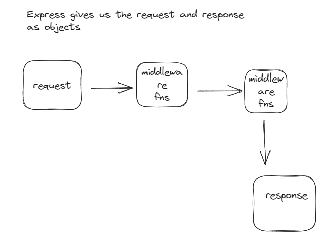

# :books: TODAY I LEARNED

## Node

- Javascript runtime environment that helps javascript code can execute outside of the browser. We can use javascript to build servers that run on the operating system
- Through a part of node called npm (node package manager) we can download other people's code so we don't have to reinvent wheel every time
- To download packages from npm first we have to create a node project (npm init -y) => will create package.json file. After we ran npm i package's name, it created a node_modules folder
- Note: There are two different systems of import and export in javascript land: common js (node) and ES6 modules (browser)

## Express.js

- Node.js web application framework
  

## Prisma

- Prisma is a server-side library that helps developers read and write data to the database in an intuitive, efficient and safe way (ORM - Object relational mapping)
- How do we use Prisma?
  - npm i prisma
  - npx prisma init
  - We have to change provider to database we used
  - Once we have our schema, how do we tell db what the table in the db looks like: npx prisma migrate dev

## CORS

- Cross origin resource sharing
- Security feature by the browser
- No one can access the server to send requests except clients who are sending requests from the same domain

## Practice Projects

- [Emoji-server](https://github.com/giangpham-cfg/Emoji-server)
- [Spammer-server](https://github.com/giangpham-cfg/Spammer-backend)
