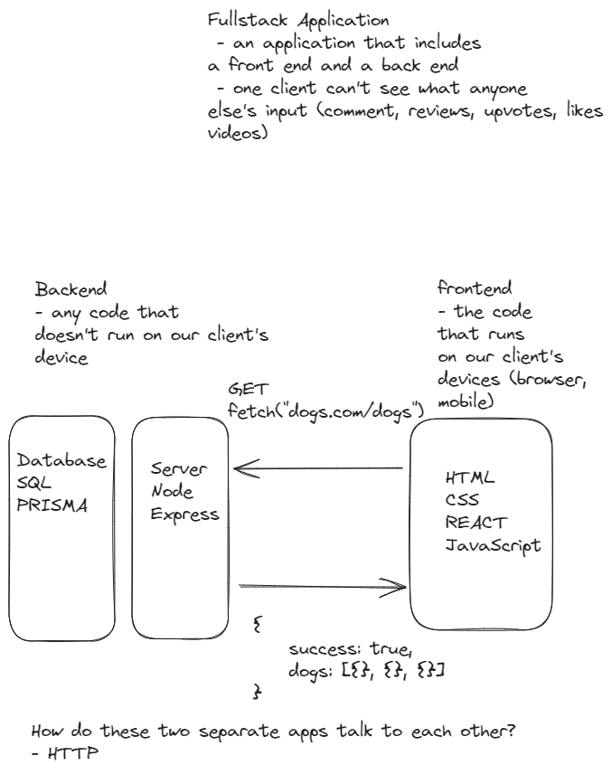

# :books: TODAY I LEARNED

## Javascript

### DOM part1

- DOM Manipulation
- Query Selector
- setInterval vs setTimeout

### DOM part2

- Event listeners
- [Challenge for practice](https://dom-part2.netlify.app/)

### Array

- What are arrays? A list of values all stored in one variable.Values associated with each other in a group
- [Challenge for practice](https://array-functional-game.netlify.app/)

### Object

- Contents to learn:
  - What are objects? A data structure in javascript {key: value}, a collection of values all grouped together
  - How do we access the items in an object? We have to access an objects properties using dot notation or bracket notation
  - One of the ways of storing our primary state in applications is going to be an array of objects
  - Iterate object using for...in loop
  - Object.keys()
  - Object.values()
  - Object.entries()
- [Project: Milkman game](https://milkman-fun-giang.netlify.app/)
  - How the game works:
    - When you click on the cow, the counter for both milk bottles and your earnings starts ticking up
    - You can sell the milk produced by your cows, earning money that will be added to your bank account.
    - Once you've saved up $25, you start to unlock producer options for purchase. These producers aid in automatically generating more milk bottles
    - The balance in your bank determines the available producer options to explore, and owning more producers enhances your earnings significantly

### React - Intro

- Contents to learn:
  - A Javascript framework (application) that builds us websites (html, css, js). We write fuctions that return JSX (looks like html) and it will produce the html, css and js
  - Why we use React? It turns out manually manipulating the DOM is very expensive and not to mention hard. we experience the pain of keeping the state matched with the view? React will do this for us automatically. It knows that if you change state, it will update the DOM for you. Never again we are using document.querySelector and textContent, innerText..
  - How do we make a React app?
    1. npm create vite (choose react, choose "javascript + SWC)
    2. (once we are in the correct folder) npm i
    3. npm run dev
    4. open up the link it gives you
    5. start in App.jsx
  - React component
    - Its just a function that returns JSX (stuff that looks like html) or another React component
  - React Rules:
    - In the return we can inject normal javascript just by using {}
    - We can't use "class" we have to use "className"
    - When iterating and producing a series of elements, wwe have to give a key so React can keep track and do its magic behind the scenes
    - How often does a React component run?
      - everytime the state or props changes
      - also it runs once the first time to mount
    - When we want a function to run a single time so use useEffect
    - Modules:
      - The files that end in JSX, we can think of as their own module (one module knows nothing about anyone else, they are their own kingdom)
      - The only way they can share info is by explicitly importing and exporting what we want to share
- [Challenge for practice](https://react-introduction-giang.netlify.app/)

### React event liteners

- useState
- Event listeners: onClick, onChange, onSubmit, onKeyDown...
- [Challenge for practice](https://react-event-listeners.netlify.app/)

### Fetch API

- Contents to learn:
  
  - Promise?
    - Object - an agreement that will eventually get a value back
    - Server requests take long
    - we don't want our application to freeze as we are waiting
    - so the browser will do the work then get back to us when it's done with the info we want
  - RESTful API: CRUD with methods including POST, GET, PUT, DELETE
- [Challenge for practice](https://fetch-api-practice.netlify.app/)
